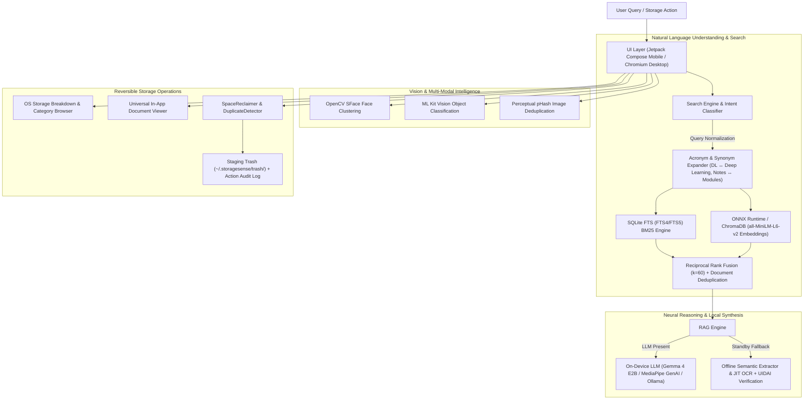
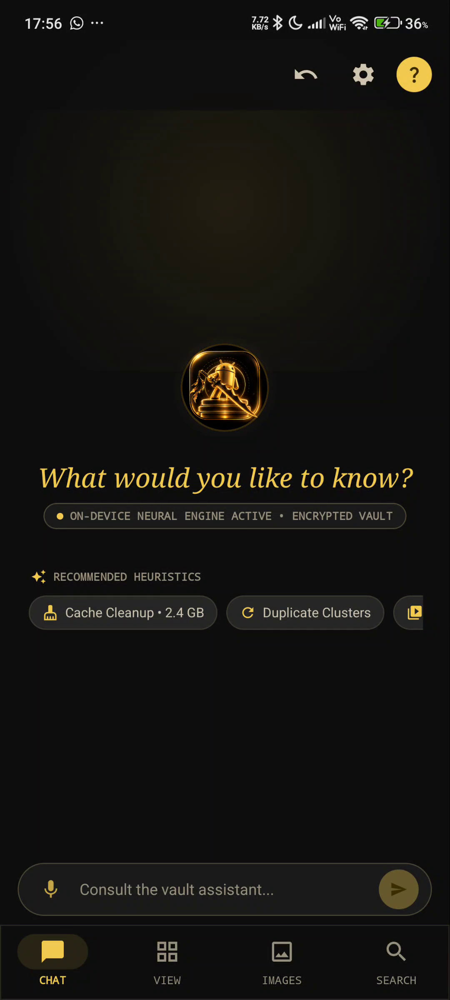
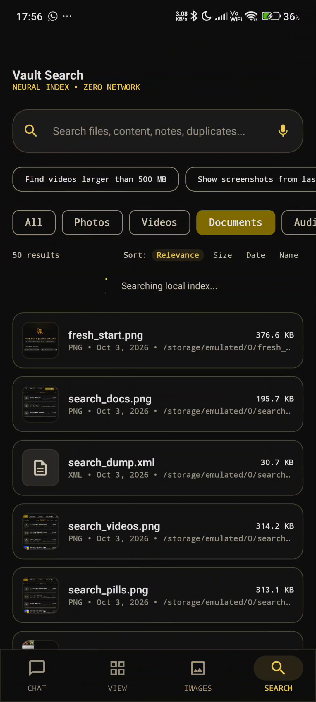

<p align="center">
  
</p>

<h1 align="center">Reiatsu (霊圧)</h1>

<p align="center">
  <strong>Intelligent, Privacy-First, 100% On-Device Storage & Neural Search Assistant for Android & Windows PC</strong>
</p>

<p align="center">
  <a href="https://github.com/Orsted-Ninja/Reiatsu/releases/latest">
    
  </a>
  <a href="https://github.com/Orsted-Ninja/Reiatsu/releases/download/v1.0.0/Reiatsu-v1.0.0.apk">
    
  </a>
  <a href="https://github.com/Orsted-Ninja/Reiatsu/releases/download/v1.0.0/StorageSense.exe">
    
  </a>
  <a href="#-the-zero-cloud-guarantee">
    
  </a>
  <a href="LICENSE">
    
  </a>
</p>

---

## 📑 Table of Contents

- [1. Overview & Zero-Cloud Guarantee](#1-overview--zero-cloud-guarantee)
- [2. 📦 Downloads & Releases (v1.0.0)](#2--downloads--releases-v100)
- [3. Key Features](#3-key-features)
  - [📱 Android Edition (Reiatsu Mobile)](#-android-edition-reiatsu-mobile)
  - [💻 Windows PC Edition (StorageSense Desktop)](#-windows-pc-edition-storagesense-desktop)
- [4. High-Level Architecture](#4-high-level-architecture)
- [5. Application Screenshots & Visual Showcase](#5-application-screenshots--visual-showcase)
- [6. Tech Stack & Dependencies](#6-tech-stack--dependencies)
- [7. Installation & Quickstart](#7-installation--quickstart)
  - [📱 Android Installation](#-android-installation)
  - [💻 Windows PC Quickstart](#-windows-pc-quickstart)
- [8. Gemma On-Device LLM Setup](#8-gemma-on-device-llm-setup)
- [9. Security, Privacy & Safety Safeguards](#9-security-privacy--safety-safeguards)
- [10. License](#10-license)

---

## 1. Overview & Zero-Cloud Guarantee

**Reiatsu (霊圧)** is a cross-platform, on-device personal storage assistant engineered for **Android** and **Windows PC**. It enables natural language file queries, semantic document search, offline optical character recognition (OCR), on-device face recognition & clustering, multi-modal deduplication, and safe reversible storage reclamation directly on your hardware.

### 🛡️ The Zero-Cloud Guarantee
* **Zero Network Boundary**: On Android, `android.permission.INTERNET` is strictly omitted from the manifest—the application is physically incapable of making network requests. On Windows, all indexing, database queries, and neural inferences run strictly on localhost.
* **100% On-Device Neural Inference**: Dense vector embeddings, face embeddings, optical text recognition, generative LLM reasoning, and full-text indexing occur completely on local hardware.
* **Zero Telemetry & Zero Data Retention**: Zero tokens billed, zero tracking metrics, zero telemetry packets, and zero file contents or embeddings ever leave your device.

---

## 2. 📦 Downloads & Releases (v1.0.0)

Pre-built, standalone binaries are available for direct download from the [Releases](https://github.com/Orsted-Ninja/Reiatsu/releases) section:

| Platform | Asset / Binary | Size | Description & Direct Link |
| :--- | :--- | :--- | :--- |
| 📱 **Android** | `Reiatsu-v1.0.0.apk` | ~345 MB | [⬇️ **Download Android APK**](https://github.com/Orsted-Ninja/Reiatsu/releases/download/v1.0.0/Reiatsu-v1.0.0.apk)<br/>Compatible with Android 8.0 to Android 15/16 (API 26+). Bundles OpenCV SFace neural network, ONNX Runtime INT8, and ML Kit OCR. |
| 💻 **Windows PC** | `StorageSense.exe` | 146 KB | [⬇️ **Download Windows Executable**](https://github.com/Orsted-Ninja/Reiatsu/releases/download/v1.0.0/StorageSense.exe)<br/>Native Windows executable. Double-click to launch in dedicated Chromium App Mode with system tray controls and Win32 Job Object process lifecycle tracking. |
| 💻 **Windows PC (Bundle)** | `StorageSense-PC-Port-v1.0.zip` | ~400 KB | [⬇️ **Download PC Port Zip Bundle**](https://github.com/Orsted-Ninja/Reiatsu/releases/download/v1.0.0/StorageSense-PC-Port-v1.0.zip)<br/>Complete portable distribution containing `StorageSense.exe`, desktop shortcut creator, CLI automation tools, batch loaders, and full guides. |

👉 View complete release notes and SHA checksums on the [**Official GitHub Releases Page**](https://github.com/Orsted-Ninja/Reiatsu/releases/tag/v1.0.0).

---

## 3. Key Features

### 📱 Android Edition (Reiatsu Mobile)

* **🧠 On-Device Generative AI (Gemma via MediaPipe Tasks GenAI)**
  * **Primary Model**: `gemma-4-e2b-it.litertlm` (LiteRT / MediaPipe format).
  * **Secondary / GPU Fallback**: `gemma-2b-it-gpu-int4.bin` / `gemma-2b-it.bin`.
  * Real-time token-by-token streaming inference accelerated via Qualcomm Adreno GPU & Snapdragon Hexagon NPU.
  * **Graceful Standby Mode**: If no LLM weights are placed in the models folder, Reiatsu operates at 100% functionality using neural embeddings, offline OCR, and semantic extractors.

* **🔍 Multi-Stage Hybrid Search Engine (BM25 + Dense Vector + RRF)**
  * **Stage 1 — Lexical Precision**: SQLite FTS4 virtual table using Porter Stemming and Okapi BM25 scoring derived from SQLite `matchinfo('pcx')`.
  * **Stage 2 — Dense Neural Search**: 384-dimensional document embeddings powered by quantized INT8 `all-MiniLM-L6-v2` via ONNX Runtime Android (`onnxruntime-android:1.17.0`).
  * **Stage 3 — Reciprocal Rank Fusion**: Merges lexical candidates and dense vector similarity using RRF ($k=60$) with document-level deduplication.

* **👤 On-Device Face Recognition & Visual Photo Organization**
  * Embedded **OpenCV SFace INT8 ONNX** neural network generating 128-D face embeddings directly on mobile.
  * Automatic face clustering grouping photos by person (similar to Google Photos) with zero internet access.
  * Offline **Google ML Kit Vision** categorizing gallery images into People, Vehicles, Food, Text, and Screenshots.

* **🎓 Context- & Intent-Aware Query Intelligence**
  * **Acronym Expansion**: Automatically connects course abbreviations (`DL` $\leftrightarrow$ *Deep Learning*, `ML` $\leftrightarrow$ *Machine Learning*, `AI` $\leftrightarrow$ *Artificial Intelligence*).
  * **Academic vs. Notes Discrimination**: Boosts course lecture notes and syllabus modules (`DL_MOD*`, `*module*`, `*lecture*`, `*unit*`), while penalizing external academic journal DOIs.
  * **Verified Identity Extraction**: Validates 12-digit UIDAI Aadhaar (`\b\d{4}\s\d{4}\s\d{4}\b`) and PAN numbers directly from physical documents (`aadhar .pdf`), filtering out irrelevant tickets or invoices.

* **📑 Universal In-App File Viewer**
  * Self-contained, zero-dependency viewer supporting **PDFs, Word documents (.docx), Presentations (.pptx), Images (JPEG/PNG/WEBP), Videos (MP4/MKV), Audio, and Code/Plaintext**.
  * View documents directly inside Reiatsu without requiring third-party office apps.

* **📊 Live OS Storage Breakdown & Repositories**
  * Live category drill-downs: **Documents & PDFs**, **Images & Photos**, **Videos**, **Audio & Music**, **APKs & Archives**, and **Downloads**.
  * Dynamic smart repositories: **Recently Opened**, **Recently Deleted**, **Duplicates** (SHA-256 verified), **Large Files**, and **Old Files**.

---

### 💻 Windows PC Edition (StorageSense Desktop)

* **🖥️ Dedicated Native Desktop App Mode**
  * Launches in dedicated Chromium/Edge Application Mode (`--app=http://localhost:8501`) without address bars, bookmark strips, or browser tab noise.
  * Integrates with the **Windows System Tray** near the taskbar clock for quick status checks, live log inspection, engine restarts, and clean shutdown.

* **⚡ Kernel-Managed Lifecycle (Win32 Job Object)**
  * Child server processes and Python workers are tracked via Windows Kernel Job Objects (`SetInformationJobObject`). Closing the desktop window automatically terminates child workers with **zero orphan background processes**.

* **🔎 Dual-Tier Autonomous Retrieval Engine**
  * **Tier-1 Pre-Indexed Hybrid Search**: SQLite FTS5 BM25 lexical engine + ChromaDB dense vector store (`all-MiniLM-L6-v2`) combined with Reciprocal Rank Fusion ($k=60$).
  * **Tier-2 JIT Live Filesystem Sweeper**: Discovers unindexed or newly downloaded files on-the-fly across storage drives (`C:\`, `D:\`, `F:\`) using PyMuPDF (`fitz`) and direct memory streaming, returning immediate matches with `[LIVE DISCOVERY]` snippets and queuing them for background indexing.

* **🧹 Multi-Modal Deduplication Engine**
  * **Exact Cryptographic Duplicates**: SHA-256 binary hash matching.
  * **Semantic Document Duplicates**: Centroid cosine clustering ($\ge 0.88$) detecting drafts and revisions.
  * **Perceptual Image Duplicates**: 64-bit perceptual hashing (`pHash`, Hamming distance $\le 5$) resilient to resizing and recompression.

* **🛡️ Protected File Guardian & Reversible Staging**
  * Automatically safeguards sensitive records (`resume`, `cv`, `passport`, `tax`, `invoice`, `aadhaar`, `license`, `w2`) from deletion.
  * Deleted files are moved into a structured `.trash` sandbox with 1-click atomic restore.

---

## 4. High-Level Architecture



---

## 5. Application Screenshots & Visual Showcase

<p align="center">
  
  
</p>

<p align="center">
  
  
</p>

---

## 6. Tech Stack & Dependencies

| Component | Android Mobile (Reiatsu) | Windows PC (StorageSense Desktop) |
| :--- | :--- | :--- |
| **Language & Tooling** | Kotlin 2.0.0, Gradle 8.7 | Python 3.10–3.12, C# (.NET WinForms Runner) |
| **UI Framework** | Jetpack Compose + Material 3 (Obsidian & Gilt) | Streamlit + Chromium/Edge Dedicated App Mode |
| **Local Database** | Room 2.6.1 + SQLite FTS4 virtual tables | SQLite 3 FTS5 WAL Mode |
| **On-Device LLM** | MediaPipe Tasks GenAI (`gemma-4-e2b-it.litertlm`) | Local Ollama Integration (`gemma4:e4b`, `llama3.2`) |
| **Vector Embeddings** | ONNX Runtime Android (`all-MiniLM-L6-v2` INT8) | ChromaDB + SentenceTransformers (`all-MiniLM-L6-v2`) |
| **Computer Vision** | OpenCV SFace INT8 (Face Clustering) + ML Kit | Pillow, imagehash (`pHash`), Windows Native OCR |
| **Document Parsers** | Apache PDFBox Android, native XML | PyMuPDF (`fitz`), `python-docx`, `python-pptx` |
| **Target Platforms** | Android 8.0 (API 26) to Android 15/16 (API 35+) | Windows 10 & Windows 11 (64-bit) |

---

## 7. Installation & Quickstart

### 📱 Android Installation

#### Method 1: Sideloading via Phone Browser (Easiest)
1. Download [**`Reiatsu-v1.0.0.apk`**](https://github.com/Orsted-Ninja/Reiatsu/releases/download/v1.0.0/Reiatsu-v1.0.0.apk) directly on your device.
2. Open the downloaded file from your notifications or file manager.
3. If prompted, allow installation from your browser.
4. Launch **Reiatsu** and grant "All files access" when prompted.

#### Method 2: 1-Click ADB PC Helper
If you have your phone connected to your PC with **USB Debugging** enabled:
1. Download [**`Reiatsu-v1.0.0.apk`**](https://github.com/Orsted-Ninja/Reiatsu/releases/download/v1.0.0/Reiatsu-v1.0.0.apk) into this project directory.
2. Double-click [`Install_Reiatsu_APK.bat`](Install_Reiatsu_APK.bat).
3. The script verifies ADB connection, installs the APK, grants necessary permissions, and boots the app.

---

### 💻 Windows PC Quickstart

#### Method 1: Standalone Desktop Executable
1. Download [**`StorageSense.exe`**](https://github.com/Orsted-Ninja/Reiatsu/releases/download/v1.0.0/StorageSense.exe).
2. Double-click `StorageSense.exe`.
3. The application opens in a dedicated app window. Look for the blue icon in your system tray near the clock for controls and logs.

#### Method 2: Standalone PC Port Zip
1. Download and extract [**`StorageSense-PC-Port-v1.0.zip`**](https://github.com/Orsted-Ninja/Reiatsu/releases/download/v1.0.0/StorageSense-PC-Port-v1.0.zip).
2. Double-click `Start_StorageSense.bat` to launch the graphical dashboard, or `Create_Desktop_Shortcut.bat` to add a shortcut to your desktop.
3. For terminal usage, run `StorageSense_Assistant.bat` or `python run_cli.py`.

---

## 8. Gemma On-Device LLM Setup

Reiatsu supports direct hardware-accelerated local inference using Google Gemma weights.

### Supported Model Formats:
1. **`gemma-4-e2b-it.litertlm`** (Primary — Gemma 4 E2B LiteRT / MediaPipe format)
2. **`gemma-2b-it-gpu-int4.bin`** / **`gemma-2b-it.bin`** (Secondary — Gemma 2B INT4 MediaPipe format)

### Automated Setup Script:
Run the model setup script to download and push weights via ADB:
```cmd
Download_And_Push_Gemma.bat
```
Or execute via Python:
```bash
python scripts/download_model.py --push
```

### Manual Push via ADB:
If you already have a model binary on your computer, push it to the monitored directory:
```bash
# Push to primary model storage on phone
adb push gemma-4-e2b-it.litertlm /sdcard/StorageSense/models/

# Alternative monitored folder
adb push gemma-2b-it-gpu-int4.bin /sdcard/Download/models/
```

> [!TIP]
> **No Model? No Problem**: If model weights are not present, Reiatsu runs in **Standby Mode**. Natural language search, dense vector embeddings, offline OCR, face recognition, duplicate detection, and file viewing remain **100% functional** using built-in extractors.

---

## 9. Security, Privacy & Safety Safeguards

1. **Zero Internet Dependency**: The mobile application contains no networking code or permissions. The Windows application operates entirely on local indices.
2. **Reversible Storage Staging**: File deletions or cleanups move files to a `.trash` sandbox (`~/.storagesense/trash/`) with instant 1-tap undo rollbacks.
3. **Protected Keyword Guardian**: Heuristics safeguard identity and financial documents matching keywords like `tax`, `resume`, `cv`, `invoice`, `aadhaar`, `aadhar`, `pan`, `passport`, `salary`, or files modified within 14 days.
4. **Interactive Two-Phase Confirmation**: Bulk cleanup and space reclamation actions always present preview summaries before any file is moved.

---

## 10. License

This project is open-source software licensed under the [MIT License](LICENSE).
